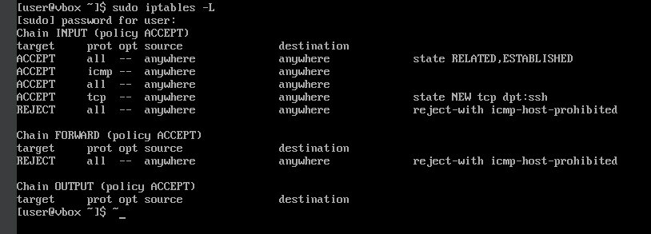
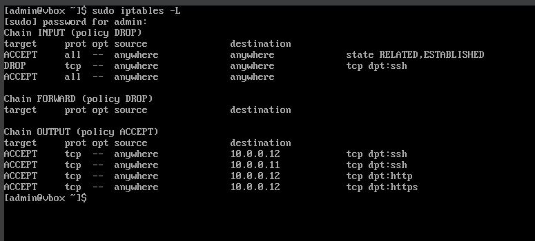
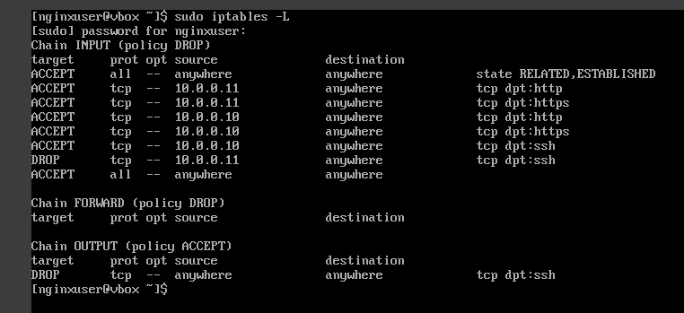

# Documentation du TP : Configuration d'un Serveur Web Nginx avec Contrôle d'Accès

## 1. Introduction

### 1.1. Objectif du TP
Le but de ce TP est de se familiariser avec la configuration des règles de pare-feu à l'aide d'**iptables**, tout en configurant un serveur web Nginx sur une machine dédiée. L'accent est mis sur le contrôle d'accès au serveur en fonction des rôles des utilisateurs (client et administrateur).

### 1.2. Environnement
- **Machine A** : Client (User)  
  **IP** : 10.0.0.11
- **Machine B** : Administrateur (Admin)  
  **IP** : 10.0.0.10
- **Machine C** : Serveur Nginx  
  **IP** : 10.0.0.12

## 2. Prérequis

### 2.1. Systèmes d'exploitation
- Rocky Linux pour toutes les machines.

### 2.2. Configuration des machines

Donc toutes les machines ont une ip statique et le serveur nginx a une configuration par défaut.

## 3. Configurations iptables

### 3.1 Machine A

### 3.2 Machine B

### 3.3 Machine C

## 4. Conclusion 

Toutes les connexions demandées (HTTP, HTTPS, et SSH) fonctionnent correctement selon les rôles définis pour chaque utilisateur. Ce TP a permis de se familiariser avec la configuration des règles de pare-feu et la gestion des accès réseau tout en renforçant les compétences pratiques en administration système.
